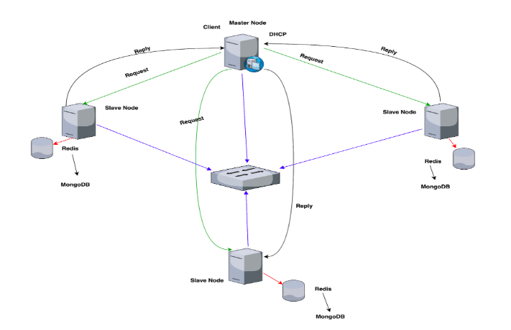

# Project Fluffy

### Description
Project Fluffy is a distributed system that acts a data-storage platform where network of server nodes are connected with switches and LAN cables.  
Various distributed systems concepts are used to make Project Fluffy fault tolerant and highly scalable. The whole system is built on the gRPC framework which uses
protobuf message format.
DHCP server is being used to assign ips for the nodes in the network. So, the server node settings has to be changed to get ip from a DHCP server.
Redis is being used as in-memory database to store Master metadata and cache in Slave nodes.
MongoDB is being used as backup database for each server node.
You can process the files of any type in the fluffy. Every file is converted to chunks of byte stream and stored in the Slave node memory(Database-Redis and MongoDB).

### Cluster Architecture

### Software requirements:
1. Java 1.8
2. Apache Ant
   [Ant installation steps](https://ant.apache.org/manual/install.html)
3. Protobuf compiler
   [Protobuf installation](https://github.com/protocolbuffers/protobuf)
4. gRPC
   Build GRPC **codegen java_plugin** from [here](https://github.com/grpc/grpc-java/tree/master/compiler)
5. DHCP server
   Requirements: **Docker**
   [DHCP installation](https://github.com/container-images/dhcp-server)
6. python3 
7. Redis
8. MongoDB

### Steps to run the cluster:
1. To run the master, use cleanUp.sh which does the following steps for you - [Instructions to run the Master](masterStepsToRun.md)
2. To run the slaves - [Instructions to run the Slaves](slaveStepsToRun.md)  
3. Connect the nodes to the switch or network.
4. If you wish to run java client generate gRPC java classes using java codegen plugin and the run runClient.sh script.
5. Else if python client, generate gRPC python classes using python gRPC tools and then run runPythonCllient.sh script.

### Fluffy Functionalities:
1. Client has to join the system using his username.
2. Fluffy gives you different options to start.
3. You can upload a file, download a file, update a file, search a file, list all files and delete a file.
4. When you download a file, output file is generated as output-*yourOriginalFileName* in the project folder.

[Documentation](documentation/CMPE%20275%20Project1%20Report.pdf)

### Contributors
1. [Nrupa Chitley](https://github.com/nrupachitley)
2. [Prahba Veerubhotla](https://github.com/Prabha-Veerubhotla)
3. [Prathamesh Patki](https://github.com/PrathameshPatki)
4. [Vinod Katta](https://github.com/vinodkattaSJSU)
